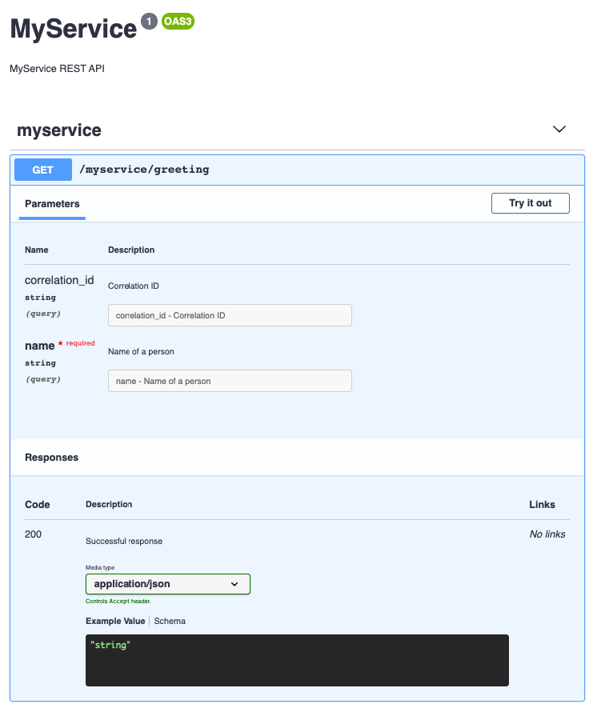

#  <br/> Swagger UI for Pip.Services in Dart

This module is a part of the [Pip.Services](https://pipservices.org) polyglot microservices toolkit.

The swagger module provides a Swagger UI that can be added into microservices and seamlessly integrated with existing REST and Commandable HTTP services.

The module contains the following packages:
- **Build** - Swagger service factory
- **Services** - Swagger UI service

<a name="links"></a> Quick links:

* [API Reference](https://pub.dev/documentation/pip_services4_swagger/latest/pip_services4_swagger/pip_services4_swagger-library.html)
* [Change Log](CHANGELOG.md)
* [Get Help](https://www.pipservices.org/community/help)
* [Contribute](https://www.pipservices.org/community/contribute)


## Use

Add this to your package's pubspec.yaml file:
```yaml
dependencies:
  pip_services4_swagger: version
```

Now you can install package from the command line:
```bash
pub get
```

Develop a RESTful service component. For example, it may look the following way.
In the `register` method we load an Open API specification for the service.
You can also enable swagger by default in the constractor by setting `_swaggerEnable` property.
```dart
class MyRestController extends RestController {
  MyRestController() : super() {
    baseRoute = 'myservice';
    swaggerEnable = true;
  }

  FutureOr<Response> greeting(Request req) async {
    var name = req.params['name'];
    var response = 'Hello, ' + name.toString() + '!';
    return sendResult(req, response);
  }

  void register() {
    registerRoute(
        'get',
        '/greeting',
        ObjectSchema(true).withRequiredProperty('name', TypeCode.String),
        greeting);

    registerOpenApiSpecFromFile('./src/controllers/mycontroller.yml');
  }
}
```

The Open API specification for the service shall be prepared either manually
or using [Swagger Editor](https://editor.swagger.io/)
```yaml
openapi: '3.0.2'
info:
  title: 'MyService'
  description: 'MyService REST API'
  version: '1'
paths:
  /myservice/greeting:
    get:
      tags:
        - myservice
      operationId: 'greeting'
      parameters:
      - name: trace_id
        in: query
        description: Trace ID
        required: false
        schema:
          type: string
      - name: name
        in: query
        description: Name of a person
        required: true
        schema:
          type: string
      responses:
        200:
          description: 'Successful response'
          content:
            application/json:
              schema:
                type: 'string'
```

Include Swagger service into `config.yml` file and enable swagger for your REST or Commandable HTTP services.
Also explicitely adding HttpEndpoint allows to share the same port betwee REST services and the Swagger service.
```yaml
---
...
# Shared HTTP Endpoint
- descriptor: "pip-services:endpoint:http:default:1.0"
  connection:
    protocol: http
    host: localhost
    port: 8080

# Swagger Service
- descriptor: "pip-services:swagger-service:http:default:1.0"

# My RESTful Service
- descriptor: "myservice:service:rest:default:1.0"
  swagger:
    enable: true
```

Finally, remember to add factories to your container, to allow it creating required components.
```dart
...
import 'package:pip_services4_container/pip_services4_container.dart';
import 'package:pip_services4_swagger/pip_services4_swagger.dart';
import 'package:pip_services4_swagger/pip_services4_swagger.dart';

class MyProcess extends ProcessContainer {
  MyProcess(): super('myservice', 'MyService microservice') {
    
    factories.add(DefaultRpcFactory());
    factories.add(DefaultSwaggerFactory());
    factories.add(MyServiceFactory());
    ...
  }
}
```

Launch the microservice and open the browser to open the Open API specification at
[http://localhost:8080/greeting/swagger](http://localhost:8080/greeting/swagger)

Then open the Swagger UI using the link [http://localhost:8080/swagger](http://localhost:8080/swagger).
The result shall look similar to the picture below.



## Develop

For development you shall install the following prerequisites:
* Dart SDK 3
* Visual Studio Code or another IDE of your choice
* Docker

Install dependencies:
```bash
pub get
```

Run automated tests:
```bash
pub run test
```

Generate API documentation:
```bash
./docgen.ps1
```

Before committing changes run dockerized build and test as:
```bash
./build.ps1
./test.ps1
./clear.ps1
```

## Contacts

The Dart version of Pip.Services is created and maintained by:
- **Sergey Seroukhov**
- **Danil Prisiazhnyi**

The documentation is written by:
- **Levichev Dmitry**
